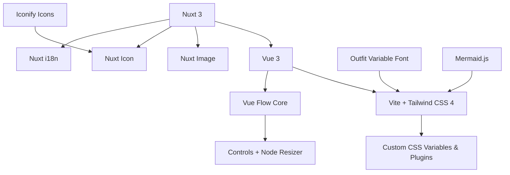

# Meridian Landing Page

[](https://nuxt.com)
[](https://tailwindcss.com)

The official, high-performance landing page for **[Meridian](https://github.com/MathisVerstrepen/Meridian)** – an open-source Graph-Powered Conversational AI platform. Built with Nuxt 3, Tailwind CSS 4, and Vue Flow for interactive visuals.

> **Design, visualize, and run complex AI workflows on an interactive canvas.** Move beyond linear chat with branching conversations, model orchestration, and developer-native tools.

## ✨ Features

This landing page showcases Meridian's core capabilities through interactive demos, carousels, and smooth-scroll navigation:

- **Interactive Hero Canvas**: Mouse-following dot glow effects with Vue Flow graph visualization.
- **Sticky Feature Navigation**: Scroll-aware sidebar with smooth-scroll-to-section.
- **Core Features Showcase**:
    - Visual Graph Canvas with execution controls.
    - Modular Node System (prompts, attachments, GitHub integration).
    - Integrated Chat & Graph views.
    - Advanced Model Management (300+ models via OpenRouter).
    - Rich Content Tooling (Markdown, LaTeX, syntax highlighting, Mermaid diagrams).
    - Enterprise-Grade Foundation (OAuth, PostgreSQL/Neo4j, Sentry, Docker).
- **Fullscreen Image Carousel**: Auto-advancing with keyboard/fullscreen support and accessibility (ARIA labels).
- **Custom Visual Nodes**: Scaled-down, interactive previews of Meridian's node types.
- **Multi-Theme Support**: Standard, Light, Dark (GitHub), and OLED themes via CSS variables.
- **Performance Optimized**:
    - Custom Tailwind theme with earth-toned palette (`--color-ember-glow`, `--color-obsidian`, etc.).
    - Smooth animations (Tailwind transitions, Vue Flow).
    - Infinite scroll canvas background with SVG patterns.
    - Lazy-loaded images via Nuxt Image.
- **Accessibility & i18n**: ARIA roles, keyboard nav, English (extensible).
- **Responsive**: Mobile-first, up to 3xl breakpoint (1750px).

## 🛠 Tech Stack



| Category       | Tools                                                        |
| -------------- | ------------------------------------------------------------ |
| **Framework**  | Nuxt 3 (SSR/SSG), Vue 3                                      |
| **Styling**    | Tailwind CSS 4, Typography Plugin, Custom Theme (14+ colors) |
| **Graph/UI**   | Vue Flow (core, controls, resizer), Custom Node Previews     |
| **Assets**     | Nuxt Image (lazy, optimized), Iconify (MDI, Heroicons)       |
| **Utils**      | i18n (JSON locales), Composables (refs, observers)           |
| **Dev Tools**  | ESLint, Prettier (Tailwind sort/merge), TypeScript           |
| **Animations** | CSS Transitions, IntersectionObserver, SVG Animations        |

## 🚀 Quick Start

1. **Clone & Install**:

    ```bash
    git clone https://github.com/MathisVerstrepen/meridian-landingpage.git
    cd meridian-landingpage
    pnpm install  # Uses pnpm@10 (see package.json)
    ```

2. **Development**:

    ```bash
    pnpm dev
    ```

    Open [http://localhost:3000](http://localhost:3000).

3. **Build & Preview**:

    ```bash
    pnpm build
    pnpm preview
    ```

4. **Generate Static Site**:
    ```bash
    pnpm generate
    ```

## 🔧 Customization

- **Themes**: Toggle via `.theme-dark`, `.theme-oled`, etc. (CSS classes).
- **Content**: Edit `i18n/locales/en.json` for text; add locales easily.
- **Images**: Place in `public/images/` (e.g., `execution-controls-1.png`).
- **Fonts/Icons**: Outfit Variable font bundled; extend `icon.customCollections`.
- **Tailwind**: Extend `@theme` in `assets/css/main.css`.

## 📄 License

MIT © [Mathis Verstrepen](https://github.com/MathisVerstrepen). See [LICENSE](LICENSE).

---

⭐ **Star [Meridian](https://github.com/MathisVerstrepen/Meridian) and this repo!** Built with ❤️ using Nuxt.
